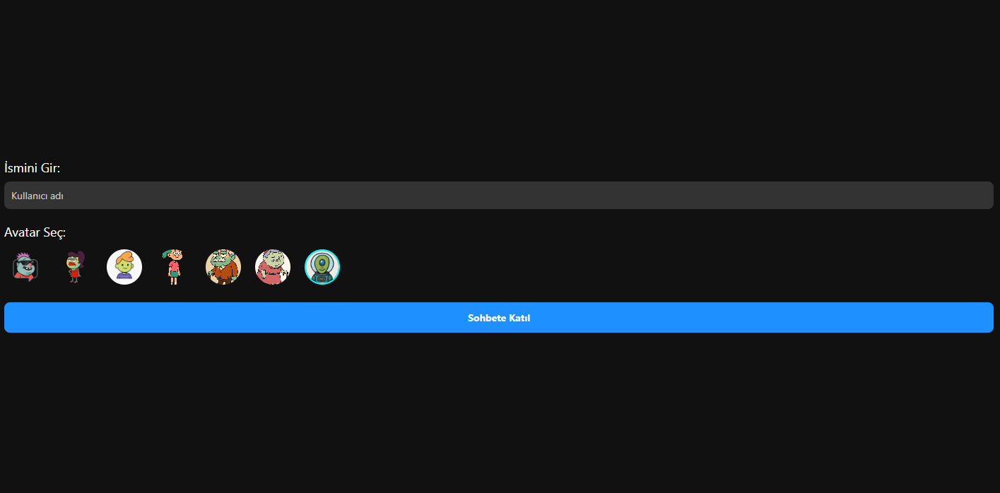

## 📸 Ekran Görüntüsü



Gerçek zamanlı mesajlaşma uygulaması.  
Expo (React Native) ve Socket.IO kullanılarak geliştirilmiştir.

## 🚀 Özellikler

- Gerçek zamanlı mesaj gönderme & alma
- Avatar seçimi ile kullanıcı profili
- Çevrim içi kullanıcı listesi
- "Yazıyor..." bildirimi
- Hızlı, sade ve mobil uyumlu tasarım

## 🛠️ Teknolojiler

- [React Native (Expo)](https://expo.dev/)
- [Socket.IO](https://socket.io/)
- [Node.js (Express)](https://expressjs.com/)

## 📦 Kurulum

### 1. Backend (Node.js + Socket.IO)

```bash
cd server
npm install
node server.js
